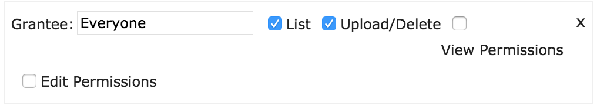

# AWS S3 Guide
Getting started with an AWS S3 bucket for website file uploads.

Christopher Grabski
2-13-2017

## PURPOSE: Create an Amazon Web Services Simple Storage Service (S3) bucket and configure it into an ExpressJS app in order to upload files to your hosted website.

## NOTE: Changes made in the AWS console can take a few hours to take effect. You may have created your bucket correctly, but it won’t work for 2-3 hours.

## OTHER RESOURCES:
Using AWS S3 to Store Static Assets and File Uploads
https://devcenter.heroku.com/articles/s3
Direct to S3 File Uploads in Node.js
https://devcenter.heroku.com/articles/s3-upload-node

### WORK DONE IN THE AWS CONSOLE

#### FINDING ACCESS KEYS
  - Sign into the AWS console (https://aws.amazon.com/console/)
  - Click on your name in the upper right part of the screen
  - In the dropdown, click ***My Security Credentials***
  - Next, click the ***Access Keys (Access Key ID and Secret Access Key)*** dropdown
  - Click ***Create New Access Key***
  - Take note of the Access Key ID and Secret Access Key generated here
  - You can have up to 3 active access keys at once. Keys that you aren’t using can be deleted so you can create new ones.      Generating a new access key is the only time AWS will tell you your secret access key. If you do not remember the secret access key associated with an access key id, you can delete an unused key id and generate a new one.

#### CREATING A BUCKET
  - We will create a bucket with permissions allowing anyone to read/write/delete objects.
  - Sign into AWS console
  - Go to ***Services > Storage > S3***

  - Click ***Create Bucket***, and take note of the name you assign it
    - ALSO, it is suggested you do not use periods, or top level domains (like .com, .net). See here for more info: http://docs.aws.amazon.com/AmazonS3/latest/dev/BucketRestrictions.html
  - You can select a region or leave it at the default
  - Click ***Create***
  - Click on your newly created bucket, then click ***Properties***
  - Within the Properties menu, click the ***Permissions*** dropdown
  - Click ***Add more permissions***, select Grantee: Everyone, List, and Upload/Delete as seen below, then click Save

  - Next, still within the permissions dropdown, click ***Edit CORS Configuration***
  - Paste in the following:
`<?xml version="1.0" encoding="UTF-8"?>
<CORSConfiguration xmlns="http://s3.amazonaws.com/doc/2006-03-01/">
    <CORSRule>
        <AllowedOrigin>*</AllowedOrigin>
        <AllowedMethod>GET</AllowedMethod>
        <AllowedMethod>POST</AllowedMethod>
        <AllowedMethod>PUT</AllowedMethod>
        <AllowedMethod>DELETE</AllowedMethod>
        <MaxAgeSeconds>3000</MaxAgeSeconds>
        <AllowedHeader>*</AllowedHeader>
    </CORSRule>
</CORSConfiguration>`
  - Click ***Save*** on the CORS configuration
  - Click ***Save*** on the permissions dropdown
  - ***Wait 2-3 hours for your changes to take effect***

### WORK DONE OUTSIDE OF AWS CONSOLE

#### TEST REPO
Here is an example of using S3 for uploading files in a node project. We will set it up as a proof of concept and as a test that our configurations work. Then the code can be adapted for your specific application.
  - clone https://github.com/flyingsparx/NodeDirectUploader
  - npm install
  - Npm install -S dotenv
  - Add dotenv as a required package in app.js
  - require('dotenv').config();
  - Add “.env” to your .gitignore
  - Create a file called “.env” in the app’s root directory
  - Add your AWS access key ID, AWS secret access key, and S3 bucket name to .env. See the FINDING ACCESS KEYS section if you don’t know what this is. If deploying to heroku, you’ll add these as heroku config variables. Example .env file:
`AWS_ACCESS_KEY_ID="XXXX"
AWS_SECRET_ACCESS_KEY="YYYY"
S3_BUCKET="ZZZZ"`

  - ‘Node app.js’ to start the app (the test repo won’t have any console log confirmations that the server is running)
  - Go to http://localhost:3000/account. You should see a page like this:

  - Click the Choose File button and try uploading an image
If you are successful, the image div will automatically update with the image you uploaded. Congrats your bucket works! Now you can pull in the code in app.js and upload.html into your application as needed.

If you receive a console error containing “Response for preflight is invalid (redirect)” see http://www.corrspt.com/blog/2016/01/17/uploading-to-amazon-s3-response-for-preflight-is-invalid-redirect-307/
It may take a few hours for your bucket to be ready for use.
